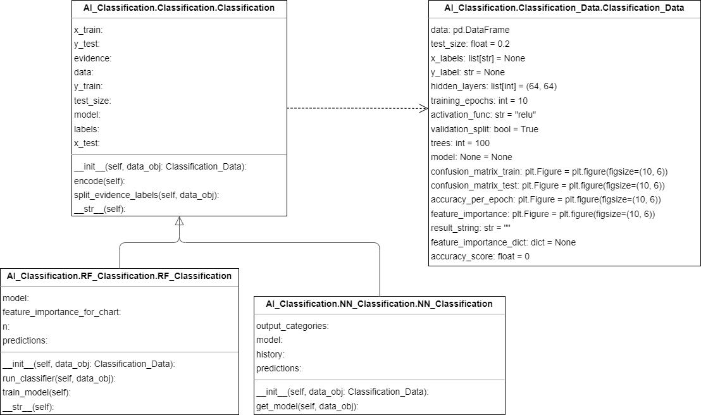

# Classification
## Class diagram

## General Information
Classification is a fundamental task in Artificial Intelligence that involves categorizing data into predefined classes or categories based on their attributes or features. In this task, an algorithm is trained using a labeled dataset, where each data point is associated with a predefined label or class. The algorithm learns to recognize the patterns and features in the data and maps them to the appropriate class or label.

Once the algorithm is trained, it can then be used to classify new, unseen data points into the appropriate classes. Classification is used in various applications such as image recognition, sentiment analysis, fraud detection, and spam filtering. Common classification algorithms include decision trees, logistic regression, support vector machines, and neural networks.

## Neural Networks
Neural Networks is a powerful classification algorithm in Artificial Intelligence that is inspired by the structure and function of the human brain. It works by simulating a network of interconnected nodes, or neurons, that process and transmit information.

During training, the Neural Network algorithm adjusts the strength of the connections between the neurons to learn the underlying patterns in the data. Once the Neural Network is trained, it can be used to classify new, unseen data points into the appropriate classes.

Neural Networks are known for their ability to handle complex, high-dimensional data and can often outperform other classification algorithms in terms of accuracy. They are commonly used in applications such as image recognition, natural language processing, and speech recognition.

There are many different types of Neural Networks, such as feedforward Neural Networks, recurrent Neural Networks, and convolutional Neural Networks, each of which is suited to different types of classification problems.

## Random Forest
Random Forest is a popular classification algorithm in Artificial Intelligence that is based on the concept of decision trees. It works by building a large number of decision trees, where each tree is trained on a random subset of the data and a random subset of the input features.

During training, the Random Forest algorithm combines the predictions of all the decision trees to make the final classification decision. This approach helps to reduce the risk of overfitting, where the model becomes too specialized to the training data and fails to generalize well to new, unseen data.

Random Forest is known for its ability to handle high-dimensional data and noisy data, making it a popular choice in many classification applications such as image recognition, medical diagnosis, and customer segmentation. It is also relatively easy to use and provides useful insights into feature importance, allowing practitioners to understand which features are most predictive of the target variable.

Description texts generated by ChatGPT