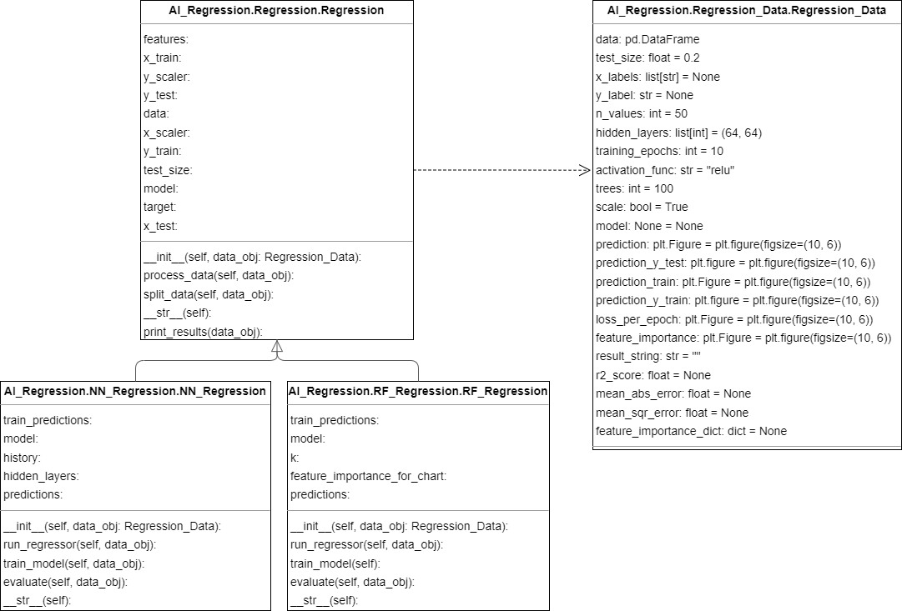

# Regression

## Class diagram

## General Information
Regression is a type of machine learning task in Artificial Intelligence that involves predicting a continuous output value based on one or more input variables. In other words, regression is used to model the relationship between the input variables and a continuous target variable.

Regression algorithms are trained using labeled datasets, where the input variables are known, and the corresponding target values are also provided. The algorithm learns to recognize the patterns and relationships between the input variables and the target variable, allowing it to make accurate predictions for new, unseen data.

Regression is used in a variety of applications, such as predicting house prices, stock prices, or customer lifetime value. Common regression algorithms include linear regression, polynomial regression, and support vector regression.

## Neural Networks
Neural Networks is a powerful regression algorithm in Artificial Intelligence that is inspired by the structure and function of the human brain. It works by simulating a network of interconnected nodes, or neurons, that process and transmit information.

During training, the Neural Network algorithm adjusts the strength of the connections between the neurons to learn the underlying patterns in the data. Once the Neural Network is trained, it can be used to make predictions for new, unseen data points.

Neural Networks are known for their ability to handle complex, high-dimensional data and can often outperform other regression algorithms in terms of accuracy. They are commonly used in applications such as predicting house prices, stock prices, or customer lifetime value.

There are many different types of Neural Networks, such as feedforward Neural Networks, recurrent Neural Networks, and convolutional Neural Networks, each of which is suited to different types of regression problems.

## Random Forest
Random Forest is a popular regression algorithm in Artificial Intelligence that is based on the concept of decision trees. It works by building a large number of decision trees, where each tree is trained on a random subset of the data and a random subset of the input features.

During training, the Random Forest algorithm combines the predictions of all the decision trees to make the final regression prediction. This approach helps to reduce the risk of overfitting, where the model becomes too specialized to the training data and fails to generalize well to new, unseen data.

Random Forest is known for its ability to handle high-dimensional data and noisy data, making it a popular choice in many regression applications such as predicting housing prices, stock prices, or customer lifetime value. It is also relatively easy to use and provides useful insights into feature importance, allowing practitioners to understand which features are most predictive of the target variable.

Description texts generated by ChatGPT